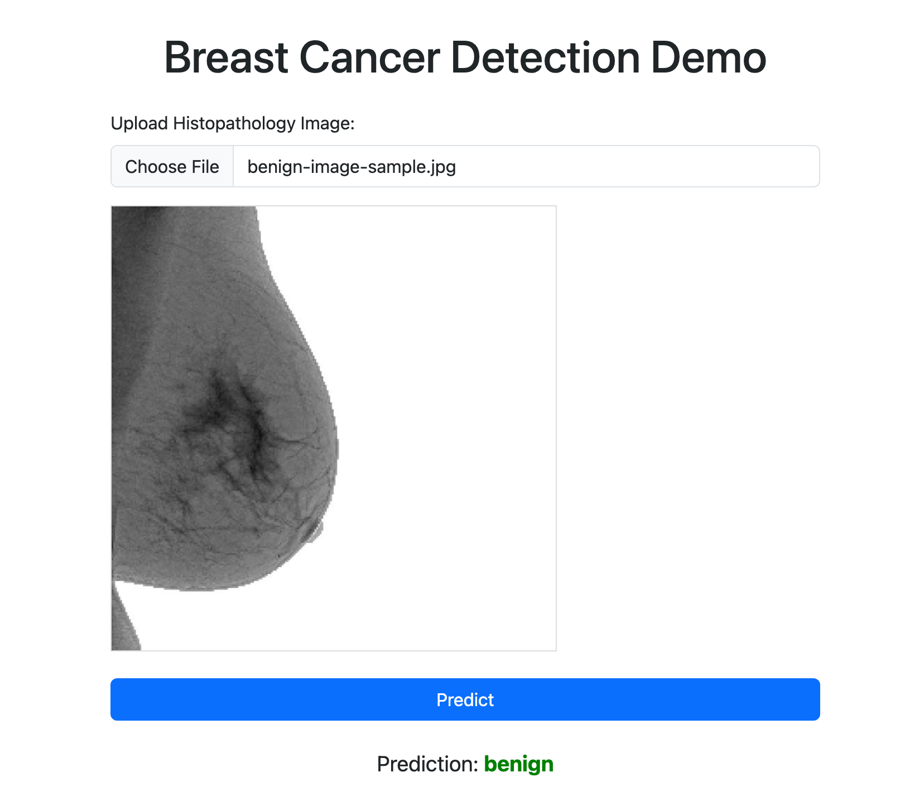
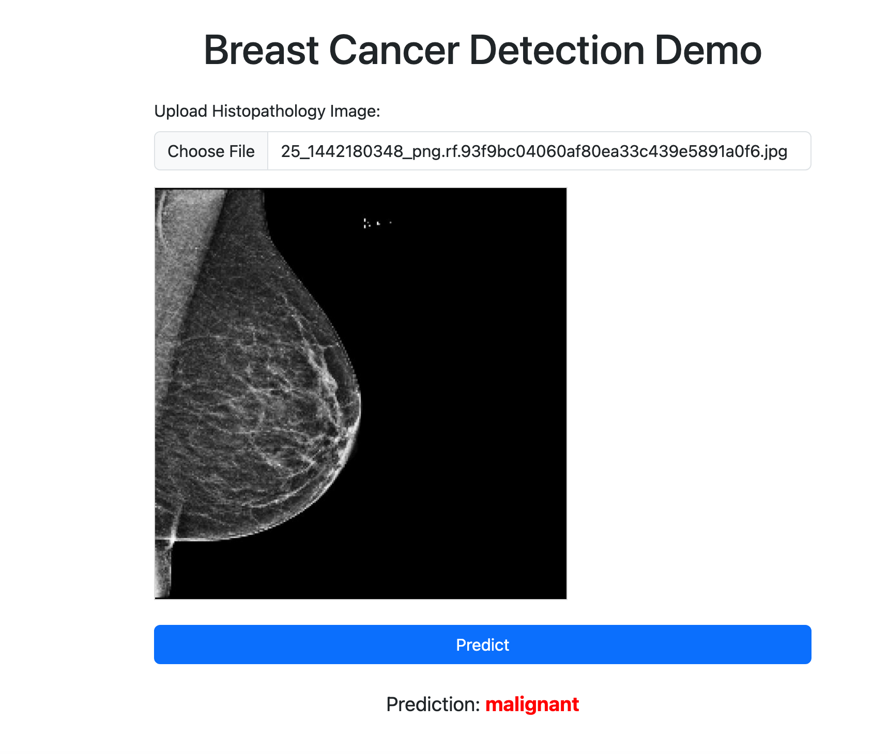

# Breast Cancer Detection Demo API

## Description

This project is a web application demonstrating binary classification (benign vs. malignant) of breast cancer histopathology images. It uses a fine-tuned MobileNetV3 Large PyTorch model served via a Flask API, featuring a simple web interface for interactive predictions.

**Current Time:** Sunday, March 30, 2025 at 11:36:04 PM
**Location:** Charlotte, North Carolina, United States

*(Disclaimer: This is currently a demonstration project and is NOT intended for actual medical diagnosis or clinical use.)*

## Current Features

* **Web Interface (`/`)**: Allows users to upload an image file and view the model's prediction (Benign/Malignant).
* **Prediction API (`/predict` - POST)**: Enables programmatic predictions by sending Base64 encoded image data within a JSON payload.
* **Health Check (`/health` - GET)**: A simple endpoint to verify if the application is running.
* **Model**: Utilizes a MobileNetV3 Large model, pre-trained on ImageNet and fine-tuned for this classification task, loaded from a local checkpoint.

## Tech Stack

* **Backend**: Python, Flask
* **ML/Image Processing**: PyTorch, TorchVision, Pillow (PIL)
* **WSGI Server (Optional)**: Gunicorn
* **Frontend**: HTML, CSS (Bootstrap 5), JavaScript (Fetch API)

## Setup & Installation

**Prerequisites:**

* Python 3.x
* pip (Python package installer)
* Git

**Steps:**

1.  **Clone the repository:**
    ```bash
    git clone <your-repository-url>
    cd <your-repository-directory>
    ```

2.  **Create a virtual environment (Recommended):**
    ```bash
    python -m venv venv
    source venv/bin/activate  # On Windows use `venv\Scripts\activate`
    ```

3.  **Install dependencies:**
    *(Note: You should create a `requirements.txt` file first by running `pip freeze > requirements.txt` after installing necessary packages locally)*
    ```bash
    pip install -r requirements.txt
    ```
    *(Likely requirements include: `flask`, `torch`, `torchvision`, `Pillow`, `gunicorn`)*

4.  **Obtain Model Checkpoint:**
    * Create a directory named `model` in the project root.
    * Place your trained model checkpoint file (e.g., `mobilenet_checkpoint.tar`) inside the `model/` directory.

5.  **Run the Application:**

    * **Development Server:**
        ```bash
        python app.py
        ```
        Access the application at `http://127.0.0.1:5000` (or the port specified in `app.py`).

    * **Production Server (using Gunicorn):**
        ```bash
        # Example: 4 workers, listening on all interfaces, port 8090
        gunicorn -w 4 -b 0.0.0.0:8090 app:app
        ```
        Access the application at `http://<your_server_ip>:8090`.

## Usage

**1. Web Interface:**

* Navigate to the root URL (`http://<host>:<port>/`) in your web browser.
* Click the "Choose File" button to select an image.
* An image preview will be displayed.
* Click the "Predict" button.
* The prediction result ("Benign" or "Malignant") will appear below the button.

**2. Health Check API:**

* Send a GET request to the `/health` endpoint.
    ```bash
    curl http://<host>:<port>/health
    ```
* Expected response: `{"status":"healthy"}`

**3. Prediction API:**

* Send a POST request to the `/predict` endpoint with a JSON payload containing the Base64 encoded image string.
    ```bash
    # Example using curl:

    # 1. Base64 encode your image (example on Linux/macOS)
    # Replace 'path/to/your/image.png' with the actual image path
    IMAGE_B64=$(base64 path/to/your/image.png | tr -d '\n')

    # 2. Send the POST request (adjust URL and port as needed)
    curl -X POST \
      [http://127.0.0.1:5000/predict](http://127.0.0.1:5000/predict) \
      -H 'Content-Type: application/json' \
      -d '{
        "image": "'"${IMAGE_B64}"'"
      }'
    ```
* Expected response: `{"prediction":"benign"}` or `{"prediction":"malignant"}`

## Project Structure

```
├── PyPI-Packages.md
├── README.md
├── __pycache__
│   ├── app.cpython-312.pyc
│   └── image_transformations.cpython-312.pyc
├── app.py
├── data
│   ├── README.md
│   ├── benign
│   ├── license.txt
│   └── malignant
├── endpoint_validation.py
├── image_transformations.py
├── model
│   └── mobilenet_checkpoint.tar
├── results
└── templates
    └── index.html
```

7 directories, 11 files
## Examples / Screenshots

Here's how the web interface looks after uploading an image and receiving a prediction:

**Benign Detection Example:**



**Malignant Detection Example:**



---

## Dockerfile

docker build -t breast-cancer-classifier:v1.0 .
docker run -p 8090:8000 --name breast-cancer-classifier breast-cancer-classifier:v1.0
docker tag breast-cancer-classifier:v1.0 awesomeai/breast-cancer-classifier:v1.0